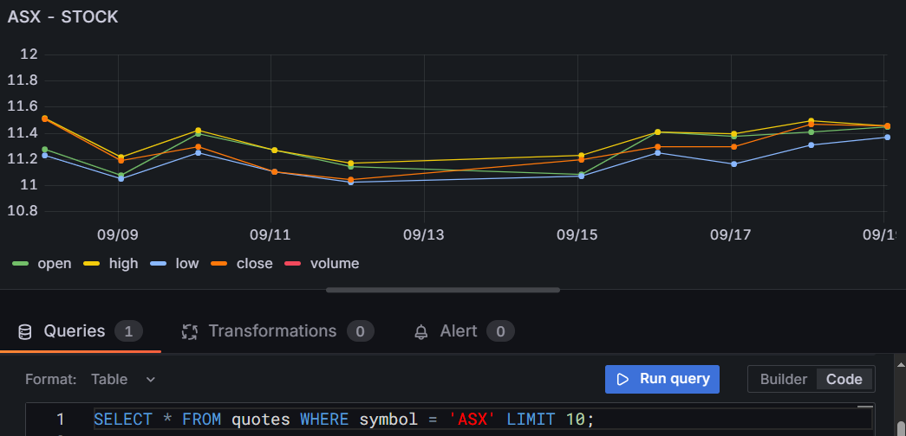
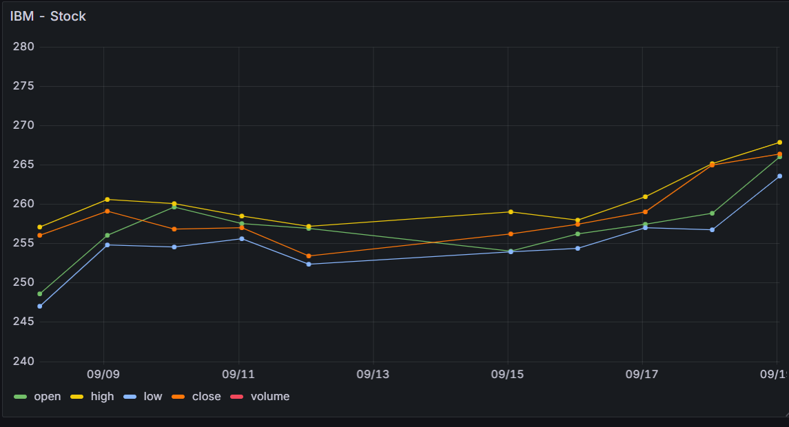

# Stock ETL: 

- [Stock ETL:](#stock-etl)
  - [Prerequisites](#prerequisites)
  - [Why this API choice](#why-this-api-choice)
  - [What I created in this](#what-i-created-in-this)
  - [Repo file structure](#repo-file-structure)
  - [Important: Live API keys and cloud creds](#important-live-api-keys-and-cloud-creds)
  - [Quickstart (local)](#quickstart-local)
  - [CI/CD and Infra](#cicd-and-infra)
  - [Swap API provider](#swap-api-provider)
  - [AWS S3 + RDS](#aws-s3--rds)
    - [Why?](#why)
    - [Terraform and GitHub actions](#terraform-and-github-actions)
  - [What does this project show?](#what-does-this-project-show)
    - [1. ETL (Extract, Transform and Load)](#1-etl-extract-transform-and-load)
    - [2. Containerisation with Docker \& Orchestration with Docker Compose](#2-containerisation-with-docker--orchestration-with-docker-compose)
    - [3. Infrastructure as Code (Terraform + AWS)](#3-infrastructure-as-code-terraform--aws)
    - [4. CI/CD (GitHub Actions)](#4-cicd-github-actions)
    - [5. Data Importance](#5-data-importance)
  - [Next steps:](#next-steps)
  - [Postgresql Commands](#postgresql-commands)
    - [To check what is inside:](#to-check-what-is-inside)
    - [Time series check:](#time-series-check)
    - [Aggregations:](#aggregations)
    - [Comparisons:](#comparisons)
    - [Trend indicators:](#trend-indicators)


**Goal:** a fully documented, runnable starter repo that demonstrates a Python ETL which pulls Stock market data from a public financial API (AlphaVantage), transforms it, and saves it to a data lake (S3 or local) + RDS (PostgreSQL). The project includes:
- Docker 
- GitHub Actions CI/CD, 
- Terraform(IaC)
- AWS (S3 + RDS + ECS/ECR) 
- Prefect/Airflow, 
- FastAPI query layer - To help non-technical. 
- Grafana (which will connect to PostgreSQL and let you create charts and dashboards locally).
 
---
## Prerequisites
- [Docker Desktop](https://www.docker.com/products/docker-desktop)
- [Terraform](https://developer.hashicorp.com/terraform/downloads)
- AlphaVantage API Key → [Get one here](https://www.alphavantage.co/support/#api-key)

## Why this API choice
- We'll fetch Stock Symbol (ASX, IBM, etc.) price and fundamentals from a free financial API, the starter uses **AlphaVantage** by default. The repo includes code and docs so you can swap providers easily.

---

## What I created in this 
- A complete repo scaffold (files shown below) with **starter code** you can run locally.
- **Dockerfiles** and **Docker-compose** for the ETL and the API service.
- **GitHub Actions** workflows for test / build / Docker push / (skeleton) deploy.
- **Terraform** to create **AWS S3 and RDS** — ready for you to `terraform apply` when you provide AWS creds.
- **Orchestration examples: a Prefect flow and an Airflow DAG.** - Still considering and implementing.
- README with step-by-step run instructions, examples and tradeoffs.

---

## Repo file structure

```
stock-etl/
├── README.md
├── etl/
│   ├── app/
│   │   ├── etl.py
│   │   ├── fetcher.py
│   │   ├── transform.py
│   │   ├── loader.py
│   │   └── config.py
│   ├── tests/
│   │   └── test_transform.py
│   └── Dockerfile
├── api/
│   ├── app.py
│   └── Dockerfile
├── infra/
│   ├── terraform/
│   │   ├── main.tf
│   │   ├── variables.tf
│   │   └── outputs.tf
├── .github/workflows/
│   ├── ci.yml
│   └── deploy.yml
└── docker-compose.yml
```

---

## Important: Live API keys and cloud creds
To run end-to-end against live AlphaVantage data you will need an API key from AlphaVantage (free tier). The README shows how to set `ALPHAVANTAGE_API_KEY` and optional AWS credentials. The project is safe to run locally without cloud creds — data will be written to `./data/`.

---

This project demonstrates a small data platform: a Python ETL that fetches daily market data, transforms it, and writes Parquet files to a data lake (local or S3 and RDS). It includes Dockerfiles, CI/CD workflows, Terraform skeleton and examples for orchestration.

## Quickstart (local)

1. Copy `.env.example` to `.env` and set `ALPHAVANTAGE_API_KEY` (get one at **https://www.alphavantage.co/support/#api-key**).
2. Build and run the ETL container locally with the FastAPI server:

```bash
cd etl
docker compose up --build
```

3. Inspect `./etl/data/` for output Parquet/CSV files.
4. Search to access the FastAPI: **http://localhost:8000**
5. You can exec into the docker container and visualise the data better with postgres. 
``` bash
docker exec -it stock-etl-postgres-1 psql -U etl_user -d quotes
# PostgreSQL commands as you are in the container and in the database.
SELECT * FROM quotes WHERE symbol = 'IBM' LIMIT 10;
# You can change IBM to any of the symbols you want and specify it in the `.env`
```
[You can find more commands below!](#postgresql-commands)


6. You can access grafana with **http://localhost:3000/**, to create graphs and dashboards with whatever stock symbol you like to help visualise the data. 
For example:






## CI/CD and Infra
- `.github/workflows/ci.yml` runs tests, lint and builds Docker images.`.github/workflows/deploy.yml` will then focus on the infra part to include the terraform portion of the CI/CD pipeline.
- `infra/terraform` contains a skeleton to provision S3 and IAM roles.

## Swap API provider
- The fetcher is provider-agnostic: see `etl/app/fetcher.py` and set `PROVIDER=finnhub` (need to pay for this API) or `provider=alphavantage`. You may need to refactor the python code in some areas. 

---
## AWS S3 + RDS
### Why?
- Storing the parquet files in S3 and the postgres on RDS to ensure for a systematic resolution. You will be able to use the integrated services in AWS to query the data and visualise it using dashboards. 
- Localised storage for the parquet files (clear audit history).
- Increases the scope of the project as you could look at Machine learning, anomaly detection and assess trends and patterns in past data - **SageMaker Studio**

### Terraform and GitHub actions 
---

## What does this project show?

- This project is essentially a mini data platform. It covers several key data engineering concepts:

### 1. ETL (Extract, Transform and Load)
- Extract: Pulls stock price data from the AlphaVantage API (or similar financial data providers).
- Transform: Cleans the raw API response, structures it into a tabular format with fields like symbol, open, high, low, close, volume, timestamp.
- Load: Saves the cleaned data in two ways:
  - Postgres Database (RDS-ready) → for relational queries and analytics.
  - Parquet files (Apache Parquet = columnar storage) → efficient, compressed storage, ideal for data lakes / S3.
- Why both?
  - Parquet/S3 = scalable, cheap, great for long-term archival + batch analytics (e.g., Athena/Spark).
  - Postgres/RDS = structured queries, API layer, easy access for dashboards. This dual-storage approach mirrors real-world data engineering patterns (data warehouse + data lake).

### 2. Containerisation with Docker & Orchestration with Docker Compose
- Each service is isolated:
  - etl service → runs the extraction & loading pipeline.
  - postgres service → acts as the target database.
  - api service (FastAPI) → exposes data via REST API endpoints.
  - grafana service → to create dashboards

Docker Compose ties them together so docker compose up runs the whole stack.
This shows you understand how to design modular, portable data platforms.

### 3. Infrastructure as Code (Terraform + AWS)
- Terraform provisions:
  - S3 bucket → to store parquet files.
  - RDS (Postgres) → production-ready managed database.

### 4. CI/CD (GitHub Actions)
- CI pipeline: runs tests (e.g., pytest on transforms) and builds docker image.
- CD pipeline: builds Docker images and runs infra workflow (**Terrafrom**)
 
This demonstrates production workflows and manage continuous delivery.

### 5. Data Importance
The dataset you’re working with:
- Provides daily stock prices (open, high, low, close, volume).
- Lets analysts:
  - Identify trends (e.g., is ASX trending up/down).
  - Compare multiple stocks (IBM vs MQG.AX, etc).
  - Build dashboards for trading signals or market insights.

This is a core financial dataset — highly relevant for financial services.

---

## Next steps:
- Add dbt model and sample transformations.
- Extend Terraform to provision ECR and an ECS/Fargate service.
- Add GitHub Actions to build and push Docker images to ECR.
- Convert ETL to a Prefect flow and show how to register it.

---

## Postgresql Commands

### To check what is inside:
```sql
-- First few rows
SELECT * FROM quotes LIMIT 10;

-- Count rows
SELECT COUNT(*) FROM quotes;

-- Distinct stock symbols
SELECT DISTINCT symbol FROM quotes;
```

### Time series check:
```sql
-- Latest 5 records for ASX (you can always change symbol)
SELECT timestamp, close, volume
FROM quotes
WHERE symbol = 'ASX'
ORDER BY timestamp DESC
LIMIT 5;

-- Daily average close price for ASX (you can always change symbol)
SELECT DATE(to_timestamp(timestamp / 1000)) AS day,
       AVG(close) AS avg_close
FROM quotes
WHERE symbol = 'ASX'
GROUP BY day
ORDER BY day;
```

### Aggregations:
```sql
-- Highest closing price per stock
SELECT symbol, MAX(close) AS max_close
FROM quotes
GROUP BY symbol
ORDER BY max_close DESC;

-- Total traded volume per stock
SELECT symbol, SUM(volume) AS total_volume
FROM quotes
GROUP BY symbol
ORDER BY total_volume DESC;
```

### Comparisons:

``` sql
-- Compare two stocks on the same dates
SELECT DATE(to_timestamp(timestamp / 1000)) AS day,
       MAX(CASE WHEN symbol = 'ASX' THEN close END) AS asx_close,
       MAX(CASE WHEN symbol = 'IBM' THEN close END) AS ibm_close
FROM quotes
WHERE symbol IN ('ASX', 'IBM')
GROUP BY day
ORDER BY day;
```

### Trend indicators:

```sql
-- Simple moving average (7 days) for ASX
SELECT day,
       AVG(close) OVER (ORDER BY day ROWS BETWEEN 6 PRECEDING AND CURRENT ROW) AS sma_7
FROM (
  SELECT DATE(to_timestamp(timestamp / 1000)) AS day, close
  FROM quotes
  WHERE symbol = 'ASX'
) t
ORDER BY day;
```

```sql
SELECT * FROM quotes WHERE symbol = 'IBM' LIMIT 10;
# You can change IBM to any of the symbols you want and specify it in the `.env`
```
